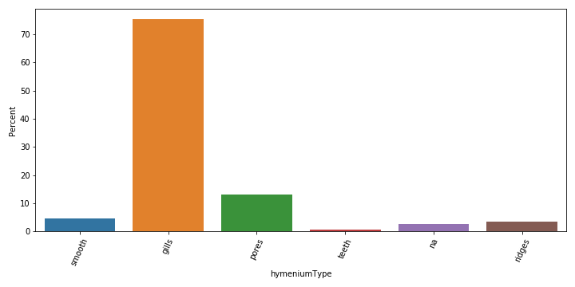
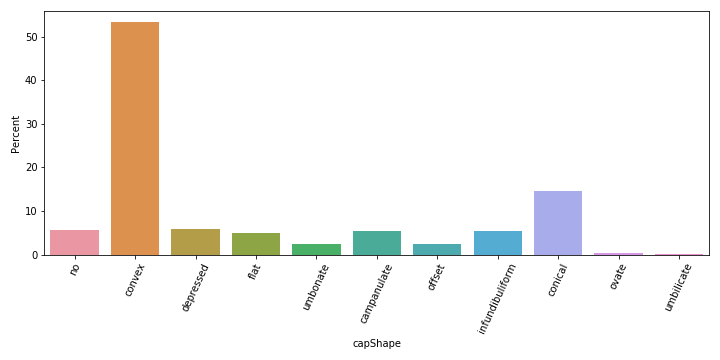
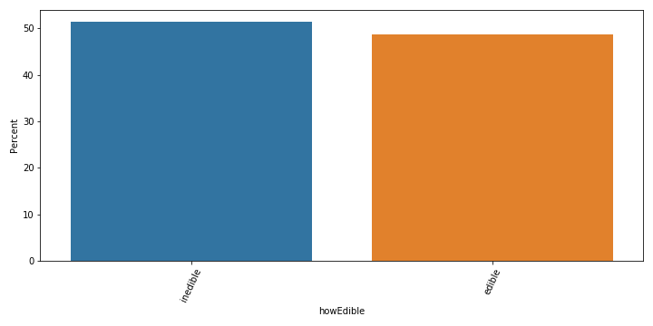

# Mushroom Classification
## The Data
Uses data scraped from wikipedia. This provides data for name, hymeniumType, capShape, whichGills, stipeCharacter, sporePrintColor, ecologicalType, and genus.

## The goal
The goal of this project was to classify edible/inedible base off other mushroom features.

## Initial EDA 

### Distribution of features 

### Distribution of target 
#### Edibility of mushroom

## Models Used
After initial EDA, I ran a decision tree, random forest, XGBoost, and  GridsearchCV models. Of all these, random forest gave the best prediction results.

